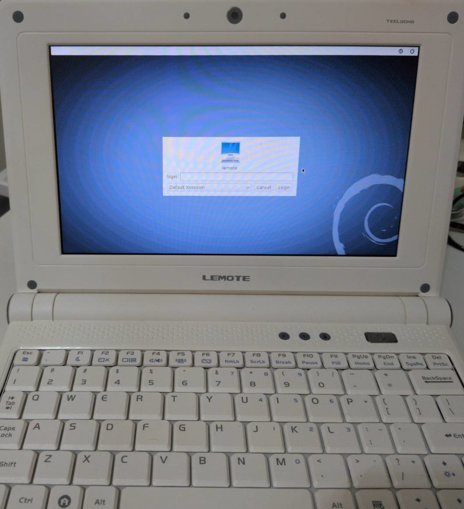
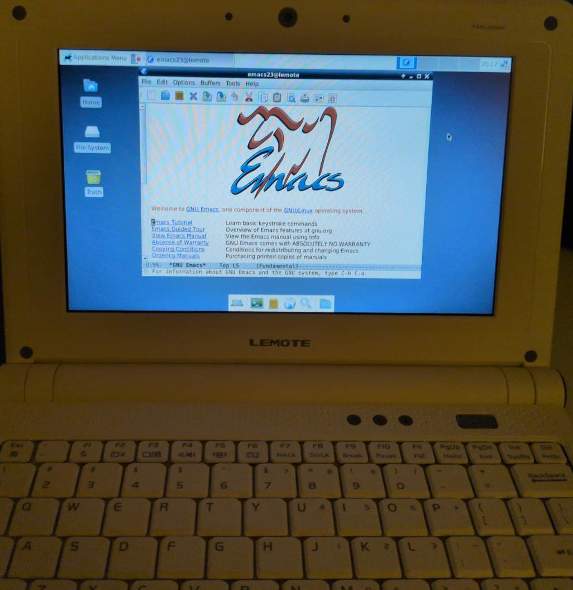

# Installing Debian 7 (Wheezy) on a Lemote Yeeloong (Loongson 2F) with an SSD

The Lemote Yeeloong is a beautiful machine and valuable piece of retro computer that offers free (as in freedom features). The Lemote Yeeloong uses the PMON bootloader, which is incredibly strict about partition tables, file systems, and USB sizes. Furthermore, because Debian 7 is archived, installing it requires bypassing expired security certificates. 

The following guide will cover the steps to get Debian 7 (Wheezy) running on this beautiful machine. My Lemote Yeeloong shown below;



My Lemote Yeeloong running Emacs:



---

## Part 1: Preparing the USB drive:

It needs to be noted that PMON cannot read exFAT, NTFS, or GPT partition tables. In addition, it fails to read partitions larger than 32GB. One must create a sall MBR/ext2 partition on the USB; this was done on a GNU/Linux machine running PopOS.

### 1. Format the USB

```bash
# unmount the drive if auto mounted
sudo umount /dev/sdX1

# open fdisk to wipe the drive and create an MBR table
sudo fdisk /dev/sdX
```

Note, that you must replace sdX with your actual USB drive, use `lsblk` to check.

Once you are in fdisk, use the following;
* `o` (Create a new empty DOS/MBR partition table)
* `n` (New partition)
* `p` (Primary)
* `1` (Partition number 1)
* `Press Enter` (Accept default first sector)
* `+2G` (Make it a 2GB partition so PMON can read it)
* `w` (Write changes and exit)

Format the new partition as ext2 (PMON's favorite file system):
```bash
sudo mkfs.ext2 /dev/sdX1
```

### 2. Download the Loongson Netboot Files

Mount the USB and download the exact Debian 7 MIPSEL kernel and installer files directly to it.

These can be downloaded from: https://archive.debian.org/debian-archive/debian/dists/wheezy/main/installer-mipsel/current/images/loongson-2f/netboot/

I included `boot.cfg `, `initrd.gz`, and `vmlinux-3.2.0-4-loongson-2f` in this tutorial for ease of use if you wish to use these.

## Phase 2: PMON and the "Time Machine" Trick

Insert the USB into the left USB port of the Lemote Yeeloong. Power it on and tap the `Del` key to enter the `PMON>` prompt.

Because Debian 7 is archived, its GPG security certificates expired years ago. If the laptop hardware clock is set to the present day, the installer will fail to download busybox and crash. We must set the clock back to 2015.

```bash
# Set PMON clock to Jan 1st, 2015 at 12:00:00
PMON> date 201501011200.00
```

Verify PMON sees your USB files:
```bash
PMON> devls
PMON> ls (usb0,0)/
```

Boot the installer, adding the override flag to ignore the expired repository signatures:
```bash
PMON> load (usb0,0)/vmlinux-3.2.0-4-loongson-2f
PMON> initrd (usb0,0)/initrd.gz
PMON> g console=tty addr=0x80200000 debian-installer/allow_unauthenticated=true
```

---

## Phase 3: The Debian Installer

Navigate the standard blue Debian installer screens.

### 1. Network and Mirror Setup

When asked for a Debian archive mirror, you must enter it manually because the defaults are offline:
* Scroll to the top of the country list and select **enter information manually**.
* **Hostname:** archive.debian.org
* **Directory:** /debian/
* **Proxy:** *Leave blank*

### 2. SSD Partitioning

When you reach the partitioner, select **Manual**. Create a new empty partition table on your internal SSD, then create these three exact partitions:

| Partition | Size | Type | Format | Mount Point | Notes for SSD Health & PMON |
| :--- | :--- | :--- | :--- | :--- | :--- |
| #1 | 500 MB | Primary (Beginning) | Ext2 | `/boot` | PMON requires a simple, non-journaled boot partition. |
| #2 | 2 GB | Primary (Beginning) | Swap | `none` | Swap space to assist the 1GB RAM limit. |
| #3 | Max (Remaining) | Primary (Beginning) | Ext4 | `/` | **Crucial:** Open "Mount options" and select `noatime` to prevent excessive read and writes from killing the SSD. |

Select **Finish partitioning and write changes to disk**.

### 3. Software Selection

When prompted to choose software to install:
* **UNCHECK** "Debian desktop environment". The default GNOME 3 desktop is too heavy for the Lemote Yeeloong 1GB of RAM. 
* Leave only "Standard system utilities" (and "SSH server" if desired).

The bootloader (`grub-yeeloong`) should install automatically at the end.

---

## Phase 4: Post-Install File System Fix

After the installation completes and the laptop reboots without the USB, PMON will hand off to GRUB, and the system will try to boot. 

However, because we set the hardware clock back to 2015 to bypass the GPG error, the newly created filesystem timestamps will conflict with the OS, causing a kernel panic that says: `fsck died with exit status 4. Give root password for maintenance.`

To fix this Time Paradox:
1. Type your root password and press Enter.
2. Run the filesystem checker automatically on your root partition (`sda3`) and boot partition (`sda1`):

```bash
fsck -y /dev/sda3
fsck -y /dev/sda1
```

Type `reboot` and hit Enter. The system will now boot cleanly into your Debian 7 terminal!


Now you can enjoy your beautiful piece of computing history the Lemote Yeeloong!

-- by msb 2026


